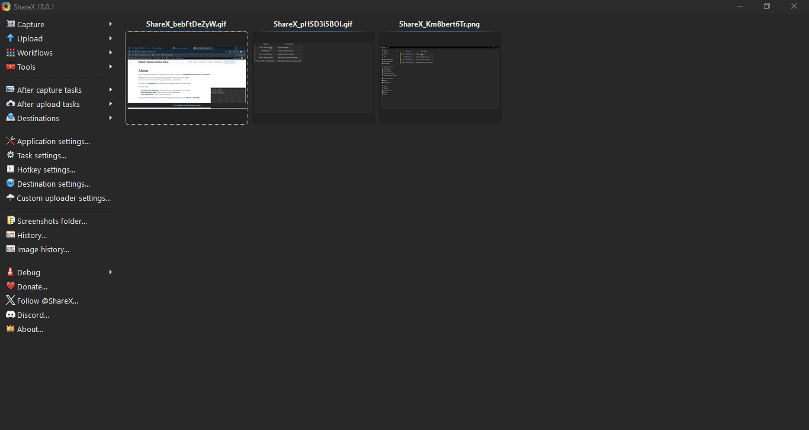
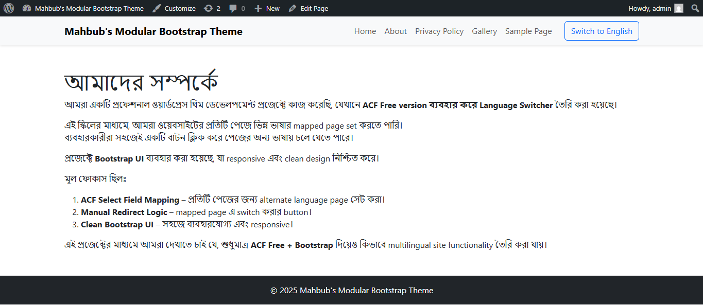
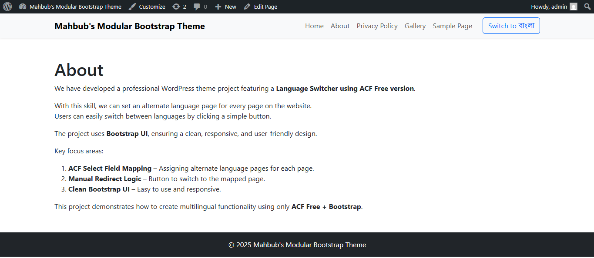
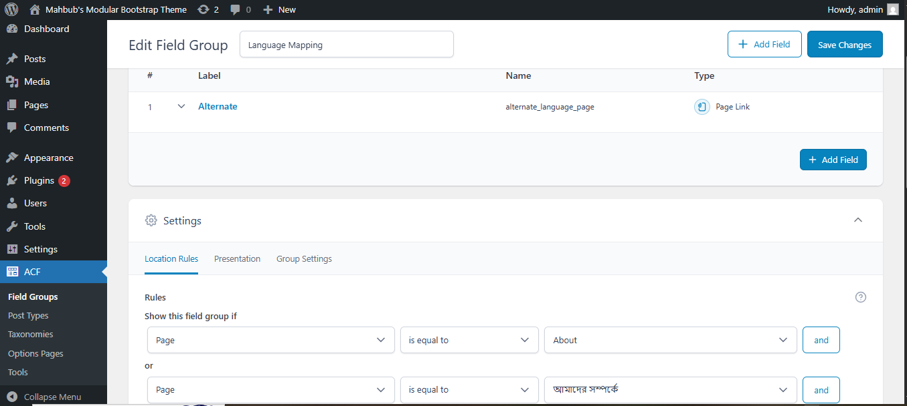

# acf-language-mapper


A **clean, modular WordPress theme** built with **Bootstrap 5**, designed for **dynamic section-based layouts**.  
This theme demonstrates a **custom multilingual switcher** (English ↔ বাংলা) using **ACF Free** and WordPress page templates.

---

## 🎬 Language Switch Preview

**Preview the language switch using screenshots:**  



---
 
## ✨ Key Features

- ✅ **Bootstrap 5** fully integrated  
- 🧩 **Modular File Structure** (`inc/` folder for reusable PHP code)  
- 🏷️ **Custom "Alternate Language Page" Field** via ACF Free  
- 🌐 **Dynamic Language Switcher Button**:  
  - বাংলা page → shows **Switch to English**  
  - English page → shows **Switch to বাংলা**  
- ⚡ **Ready-to-Use WordPress Theme Structure**  
- 🔧 **Clean & Extendable Base** for future projects  

---

## 📂 Theme File Structure
```text
acf-language-mapper/
│── inc/ # Future modular PHP files (.gitkeep included)
│── screenshots/ # Documentation screenshots
│ ├── switch-to-english.png
│ ├── switch-to-bangla.png
│ ├── acf-alternate-language-field.png
│ └── about-page-alternate-selected.png
│── footer.php
│── functions.php
│── header.php
│── index.php
│── page.php
│── single.php
│── style.css
│── README.md

```
---

## 🖼️ Screenshots

### Language Switch in Action
**বাংলা Page →**  


**English Page →**  


### ACF Setup
**Alternate Language Field Group →**  


**Page Editor (About Page with Alternate Selected) →**  


---

## ⚙️ Installation Guide

1. 📥 Download or clone this repository  
2. 📂 Copy the folder into `wp-content/themes/`  
3. ✅ Activate **acf-language-mapper** from the WordPress dashboard  
4. 🌐 Create your pages in **English** and **বাংলা**  
5. 🏷️ Use the **ACF "Alternate Language Page"** field to link between the two pages  

---

## 🛠️ Requirements


---

> ⚠️ Note: This is a WordPress theme. To view or use it fully (with dynamic features like language switcher), you need a local WordPress environment (e.g., XAMPP, WAMP, or a live server). GitHub Pages cannot run PHP, so dynamic features won't work there.

---

## 📜 License

This theme is open-source and free to use under the **MIT License**.  
Include a `LICENSE` file in your repository for best practice.

---

## 👨‍💻 Developer & Contact

**Developed by:** MahbubShaki  

🌐 **Live Demo (GitHub Pages):** [View Demo](https://mahbub-shaki.github.io/acf-language-mapper)  
🌐 **Upwork Profile:** [MahbubShaki on Upwork](https://www.upwork.com/freelancers/~015df70a23d7f58180)  
📧 Email: mahbubshaki64@gmail.com


